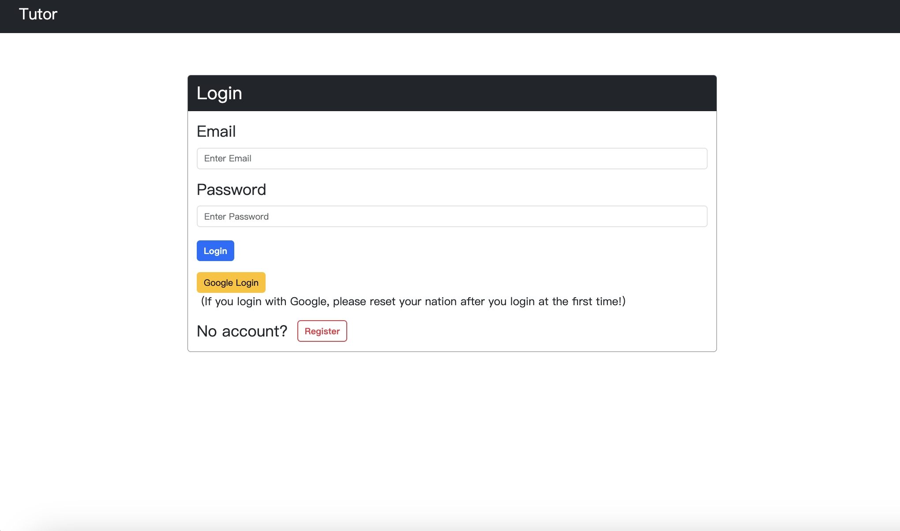
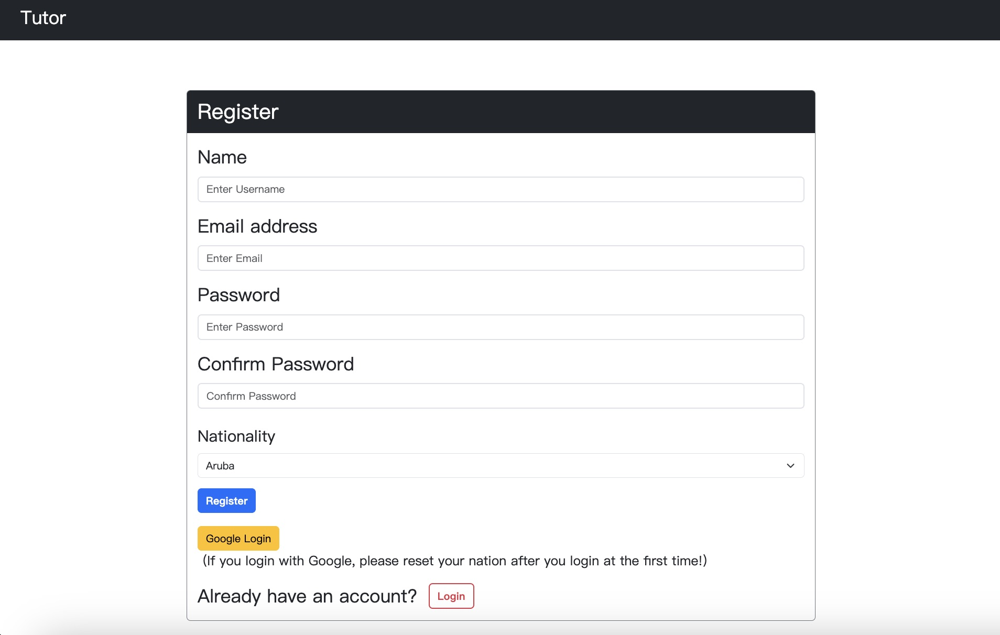
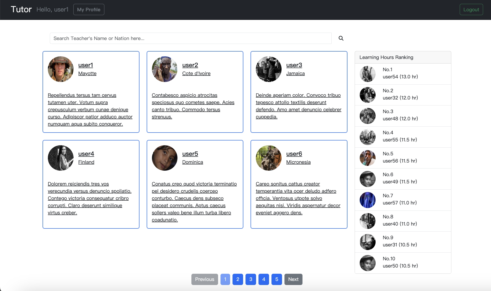
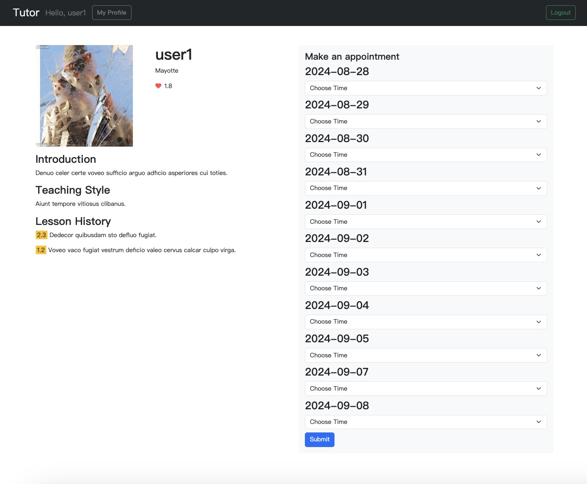
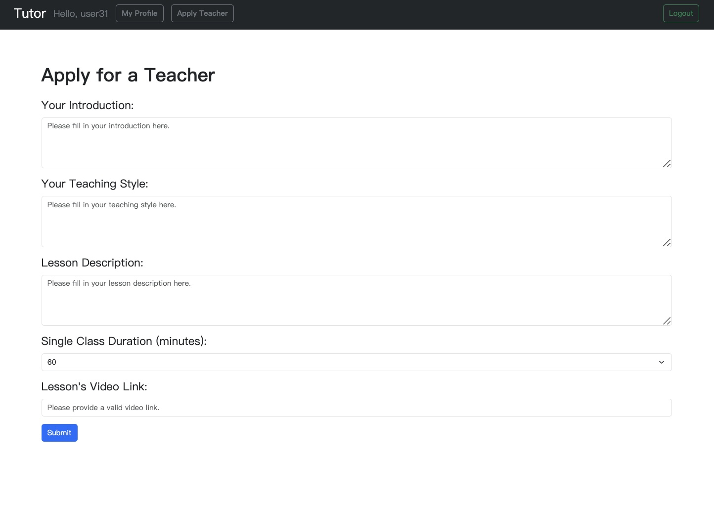
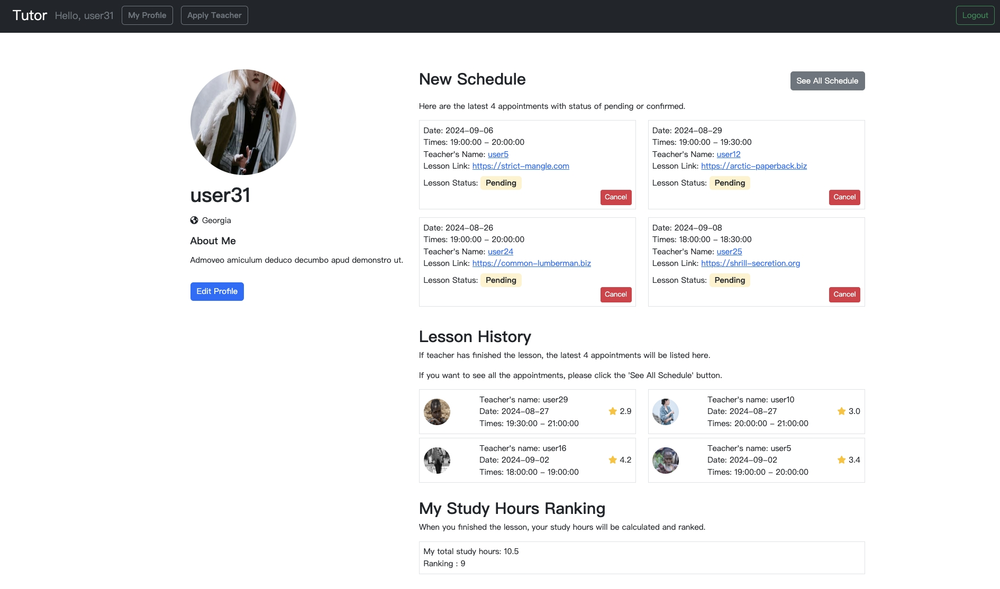
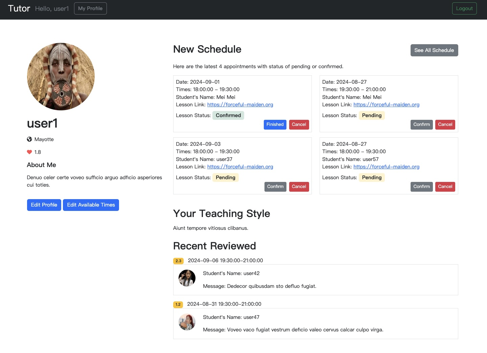
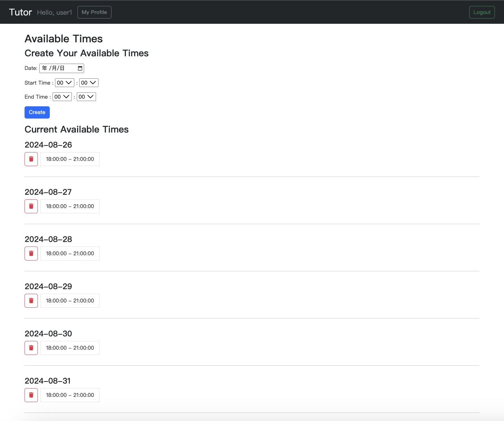
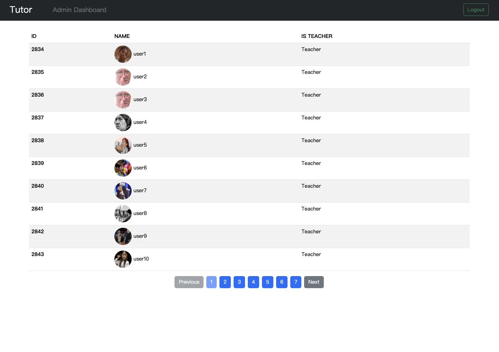

# Online Tutor
Online Tutor is a web application that connects students with tutors for online learning sessions. It provides a platform for students to find tutors, book lessons, and manage their learning experience.

## Features
- **User roles:** Student, Teacher, and Admin

- **User Authentication:** Users can register and log in using either email and password or their Google account.

- **User Profile:** Users can view or edit their profile information.

- **Search Teachers:** Users can search for specific teachers by name and nationality on home page.

- **Make appointments:** Students can view teacher's availabilities and make appointments with teachers on the teacher's profile page.

- **Become a Teacher:** Users can apply to become teachers by filling out a form to provide lesson details, including course duration and lesson's video link.

- **Teacher Profile:** Users can view every teacher's profile with lesson information and availability.

- **Lesson Status:** When a student books a lesson, the lesson status will be "Pending". After the teacher accepts the booking, the status will change to "Confirmed". If the lesson is completed, its status will change to "Finished".

- **Reviews System:** When a lesson finished, the student can rate and leave feedback for the teacher. Teachers can view their recent reviews on their personal pages.

- **Admin Dashboard:** Admin can view the entire user list but do not have access to the front-end of the platform.

## Prerequisites
> **Node.js v18.15.0**

> **MySQL v8.0.37**
## Installation
1. Open your terminal and clone the repository :   
    ```sh
    git clone https://github.com/dodoschnau/Online_Tutor.git
    ```

2. Change directory :   
    ```sh
    cd Online_Tutor
    ```

3. Install the required npm packages :   
    ```sh
    npm install
    ```

4. Set up your environment variables :

    Create a `.env` file based on the `.env.example` file and fill in your own values:
    ```sh
    cp .env.example .env
    ```

5. Create the database in MySQL :
    ```sh
    CREATE DATABASE tutor
    ```
    `Note: Make sure the MySQL server connection settings match those in config/config.json.`

6. Run the database migrations and seeders to set up the initial database structure and data :
    ```sh
    npx sequelize-cli db:migrate
    npm run seed
    ```

7. Launch the application :   
    ```sh
    npm run start
    ```
8. Open your browser and visit http://localhost:3000 to start using the program.


## Test account
The seed data provides the following accounts for use :

| Role | Email | Password |
|------|-------|----------|
| Teacher | user1@example.com | 12345678 |
| Student | user31@example.com | 12345678 |
| Admin | root@example.com | 12345678 |

## Development
To run the application in development mod
e with `nodemon` and `cross-env`, use the following command:
```sh
npm run dev:dev
```

## Authentication
### Passport Local Strategy
  > Users can register and login with their own email and password.

### Passport Google OAuth 2.0 Strategy
  > Users can login using their Google account.

  `Note` Make sure to Set up a project in the Google Developers Console and configure the app with the necessary credentials in the `.env` file.


## Screenshot
**Login Page**


**Register Page**


**Home Page**


**Teacher Page**


**Apply Teacher Page**


**Student Page**


**Teacher Profile**


**Teacher Availabilities**


**Admin Page**

